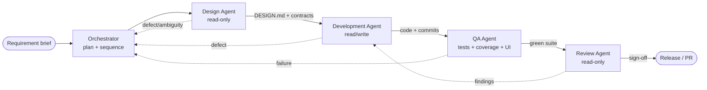

# AI Agent System

This folder contains the **explicit, version-controlled configuration** for the
AI agents that build and maintain this project. It turns the narrative in
[`../docs/AI_SDLC.md`](../docs/AI_SDLC.md) into concrete, reusable definitions
you can run, audit, and improve.

- [`agents.yaml`](agents.yaml) — declarative config for every agent (role, model,
  inputs, tools, outputs, acceptance criteria, guardrails) + the pipeline.
- `*.md` — one **playbook** per agent (objective, procedure, prompt template).

## Design philosophy

1. **Separation of concerns.** Each agent has a single responsibility (design,
   implement, test, review) and a narrow toolset. This keeps prompts focused and
   makes outputs easy to verify.
2. **Verifiable hand-offs.** A stage advances only when machine-checkable
   acceptance criteria pass (lints clean, tests green, coverage ≥ gate). The
   orchestrator enforces this.
3. **Least privilege.** Design and Review agents run **read-only**; only the
   Development agent edits source. This is encoded as `mode: read-only` and a
   restricted `tools` list.
4. **Everything is an artifact.** Designs, tests, coverage, and even the agent
   configs are committed text — diff-able, reviewable, and reproducible.
5. **Tool-agnostic.** The roles map onto Cursor subagents today, but the same
   YAML describes agents for any runner (an SDK loop, CI bots, etc.).

## The pipeline

| Agent | Responsibility | Mode | Key outputs |
|---|---|---|---|
| **Orchestrator** | Plan, sequence, verify hand-offs | plan | todo plan, hand-off gates |
| **Design** | Requirements → design + diagrams | read-only | `docs/DESIGN.md` |
| **Development** | Implement design + cross-cutting concerns | read/write | code, Docker, commits |
| **QA** | Prove correctness/resiliency, coverage | read/write | `tests/`, `reports/` |
| **Review** | Independent security + bug review | read-only | findings + fixes |

## How these were used on this project

| Agent | What it produced here |
|---|---|
| Design | [`docs/DESIGN.md`](../docs/DESIGN.md) — architecture, sequence, circuit-breaker state machine, ER diagrams |
| Development | `gateway/`, `account_service/`, `common/` (tracing, logging, metrics, **audit**, **error handling**), Docker, the web test console |
| QA | `tests/unit` (33) + `tests/functional` (35), `reports/` (92% coverage), in-browser scenario runner verified at 11/11 |
| Review | Available on demand via the Bugbot / Security-Review subagents |

## How to use (in Cursor)

Launch an agent with the `Task` tool, pasting the matching playbook's prompt
template and the relevant context. Examples:

- **Design:** `Task(subagent_type="explore" or general, prompt=<design-agent.md template + brief>)`
- **Development:** run in the main agent (read/write) following `development-agent.md`.
- **QA:** `Task(subagent_type="browser-use", ...)` for UI checks; `Shell` for pytest.
- **Review:** `Task(subagent_type="bugbot")` and `Task(subagent_type="security-review")`.

Suggested model assignments live in `agents.yaml` (`defaults.reasoning_model`
for design/review/planning, `defaults.coding_model` for implementation/tests).

## How to use (any runner / SDK)

Treat `agents.yaml` as the source of truth: for each stage, instantiate an agent
with its `model`, `tools`, and `playbook` prompt; feed it the declared `inputs`;
and gate the next stage on its `acceptance_criteria`. The `pipeline.handoff`
strings are the conditions your runner should assert between stages.

## Improving this for future projects (roadmap)

Concrete upgrades, roughly in priority order:

1. **Promote agents to first-class Cursor assets.**
   - Add a repo `AGENTS.md` (done) so guidance auto-applies in future sessions.
   - Convert playbooks into [Cursor rules](https://docs.cursor.com) under
     `.cursor/rules/` (scoped by glob) and reusable **skills**.
   - Add a **pre-commit hook** (`.cursor/hooks.json`) that runs the QA agent's
     lint+test gate before every commit.
2. **Wire the pipeline into CI.** A GitHub Actions workflow that runs lint →
   `pytest` → coverage gate → Bugbot/Security review on every PR, so the same
   acceptance criteria are enforced by machines, not trust.
3. **Coverage & quality gates as code.** Fail CI under the `coverage_gate`; add
   **mutation testing** (e.g. `mutmut`) so coverage measures real assertion
   strength, not just line execution.
4. **New specialized agents:**
   - **Contract-test agent** (Pact) to verify the Gateway↔Account contract from
     both sides independently.
   - **Performance agent** (k6/Locust) to assert latency/throughput SLOs and
     validate the circuit-breaker thresholds under load.
   - **Observability-validation agent** that asserts traces actually land in
     Jaeger/Tempo and dashboards/alerts exist.
   - **Docs agent** that keeps README/DESIGN/diagrams in sync with code.
5. **Parameterize & extract a reusable pack.** Replace project-specific names in
   the prompts with variables and lift `agents/` into a shared template repo so a
   new service starts with the same SDLC on day one.
6. **Self-improving loop.** Capture each run's failures into a "lessons" file the
   orchestrator reads next time (e.g. "ASGI contextvars don't propagate through
   `BaseHTTPMiddleware`") so the agents don't repeat known mistakes.
7. **Stronger guardrails.** Add a policy agent that blocks secrets, destructive
   git ops, and dependency additions without pinned versions.
