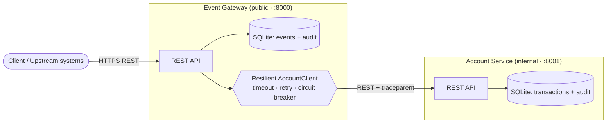
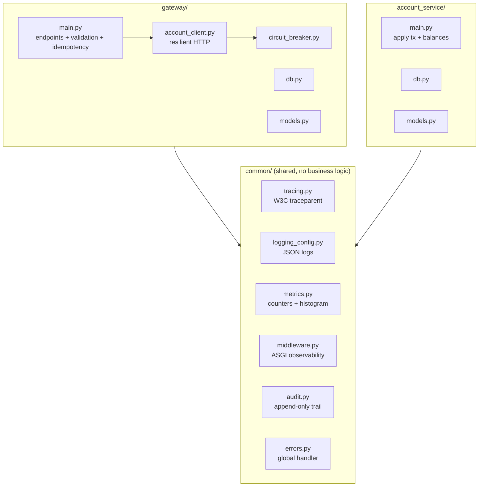
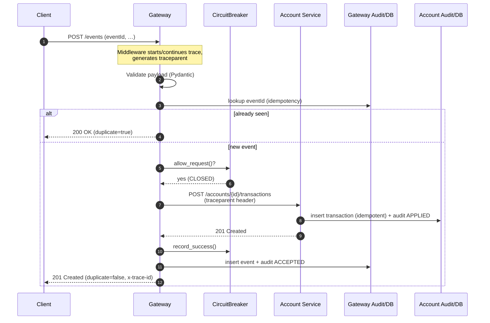
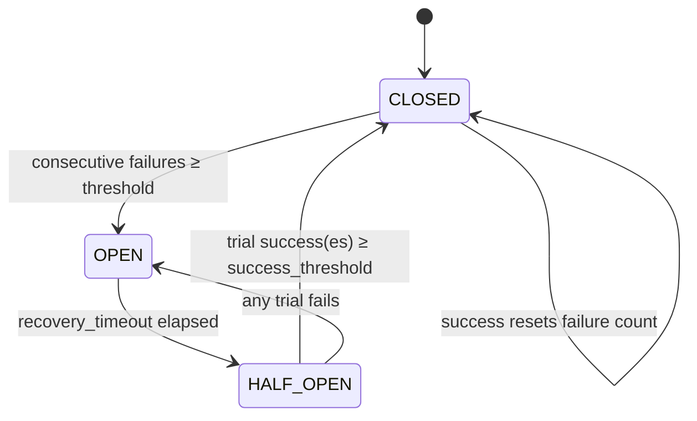
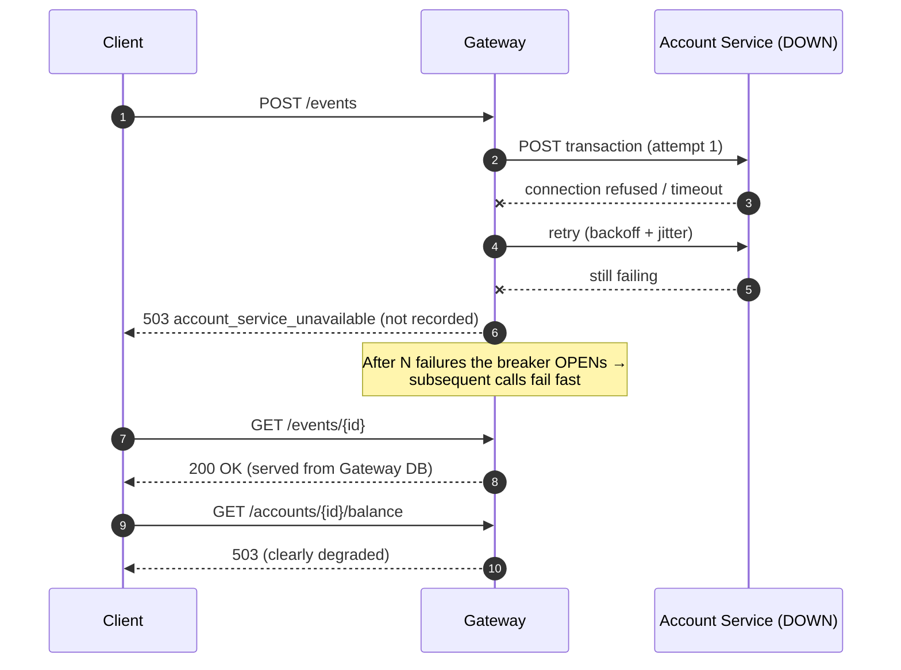
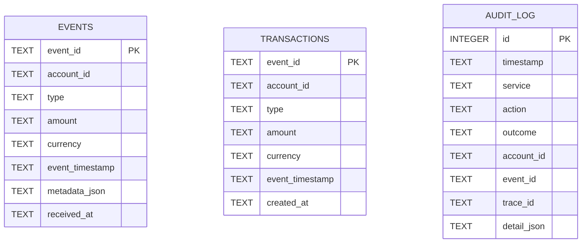

# Event Ledger — Design Document

> Authored as part of the **Design Agent** step of the AI-assisted SDLC
> workflow (see [`AI_SDLC.md`](AI_SDLC.md)). Diagrams are Mermaid so they render
> directly on GitHub/GitLab and stay version-controlled alongside the code.

## 1. Problem & goals

Ingest financial transaction events from multiple, loosely-synchronized upstream
systems and maintain correct account balances despite:

- **Duplicate delivery** — the same `eventId` may arrive multiple times.
- **Out-of-order delivery** — earlier-timestamped events may arrive later.

…while remaining **observable** (tracing, structured logs, metrics, audit) and
**resilient** (graceful behavior when a dependency is down).

### Non-functional requirements

| Concern | Target / approach |
|---|---|
| Correctness | Idempotent writes; order-independent balances; exact decimal math |
| Availability | Read endpoints stay up during downstream outage; fast-fail writes |
| Observability | Trace propagation, JSON logs, Prometheus metrics, audit trail |
| Resiliency | Timeout + retry/backoff + circuit breaker on downstream calls |
| Operability | Health checks, Docker Compose, config via env vars |
| Testability | Unit + functional suites, coverage reporting |

## 2. System context



Key boundary rule: **each service owns a private database**. The Gateway never
reads the Account Service's tables and vice-versa; they integrate only through
the REST contract in §6.

## 3. Component / module view



## 4. Request flow — `POST /events` (happy path)



**Why apply-then-persist?** The Gateway applies the transaction downstream
*before* writing its own event row. Both sides are idempotent on `eventId`, so a
retry or crash between the two steps cannot double-count, and resubmission
self-heals.

## 5. Resiliency & graceful degradation

### Circuit breaker state machine



### Behavior when the Account Service is down



This satisfies the requirement that **local reads keep working** while
**writes and balance queries fail clearly** instead of hanging or 500-ing.

## 6. API contract (Gateway ⇄ Account Service)

`POST /accounts/{accountId}/transactions`

```json
// request (from Gateway)
{ "eventId": "evt-001", "type": "CREDIT", "amount": "150.00",
  "currency": "USD", "eventTimestamp": "2026-05-15T14:02:11+00:00" }
// response 201 (new) / 200 (duplicate)
{ "eventId": "evt-001", "accountId": "acct-123", "type": "CREDIT",
  "amount": "150", "currency": "USD", "eventTimestamp": "...",
  "createdAt": "...", "duplicate": false }
```

Headers: the Gateway injects `traceparent: 00-<trace>-<span>-01`; both services
echo `x-trace-id` on responses. Amounts cross the wire as **strings** to preserve
decimal precision.

## 7. Data model



- `EVENTS` lives in the Gateway DB; `TRANSACTIONS` in the Account Service DB.
- `AUDIT_LOG` exists (independently) in **both** databases — append-only.
- `event_id` is the primary key everywhere → the idempotency guarantee is
  enforced at the storage layer, not just in application logic.

## 8. Key design decisions & trade-offs

| Decision | Rationale | Trade-off |
|---|---|---|
| Decimal-as-string money | Exact financial math (no float drift) | Slightly more (de)serialization |
| Apply-then-persist ordering | Avoids recording un-applied events | Tiny window needing idempotent downstream (provided) |
| Custom W3C tracer vs full OTel | Zero deps, satisfies requirements | No spans export UI (OTel is a drop-in upgrade) |
| In-memory SQLite + lock | Simple, embedded, per-service | Single-node; not for HA persistence |
| Layered resiliency (3 patterns) | Each covers a distinct failure mode | More config surface |
| Pure-ASGI middleware | Correct contextvar propagation | Slightly lower-level than `BaseHTTPMiddleware` |

## 9. Future work (not implemented)

- OpenTelemetry SDK + Collector + Jaeger/Zipkin for trace visualization.
- Async local queue: buffer events while the Account Service is down, drain on
  recovery (turns write outages into eventual consistency).
- Rate limiting on the Gateway; per-account currency support; persistent DB.
